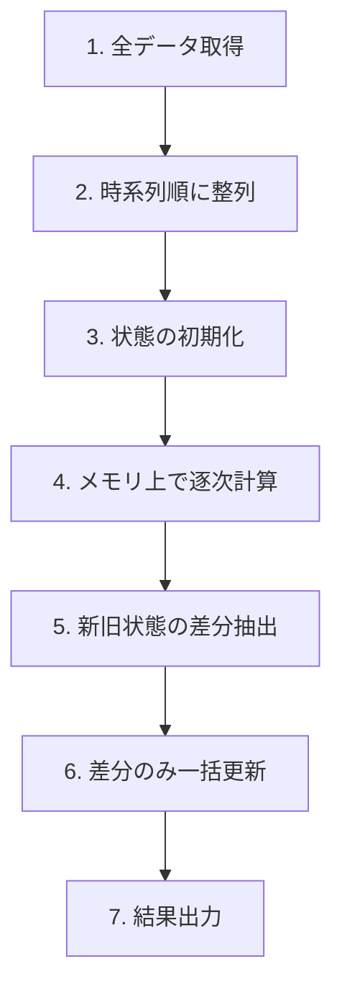

# 結論（要約）
本記事では、Elo レーティングの逐次性を踏まえたうえで、  
**フル再計算 + 差分 UPDATE** による高速・安全なバッチ処理手法を提示する。

- 全件再計算を **O(N)** で実現  
- メモリ上で逐次計算し、DB I/O を最小化  
- 差分のみをバルク UPDATE（SQL 1 回）  
- 実測：**1280 件の対局データを 55ms で再計算**

この方式は、Elo だけでなく Glicko や TrueSkill など他の逐次モデルにも応用可能である。

---

# 目次
1. はじめに（Introduction）
2. 背景（Background）
3. 課題設定（Problem Statement）
4. 提案手法（Proposed Method）
5. 評価（Evaluation）
6. 考察（Discussion）
7. まとめ（Conclusion）

---

# 1. はじめに（Introduction）
逐次計算モデルは、時系列データを前から順に処理することで状態を更新する手法であり、
Elo レーティングはその典型例である。しかし、実際のアプリケーションでは過去のデータが
後から修正・追加されることが多く、逐次更新では整合性が保てない。

本記事の貢献は以下の通りである。

1. Elo レーティングの逐次性がバッチ処理に与える影響を整理した。  
2. 全件再計算を O(N) で実現するメモリ逐次更新手法を提示した。  
3. 差分抽出とバルク UPDATE により、DB I/O を最小化する実装を示した。  
4. 実測により、1280 件の対局データに対して 55ms で再計算可能であることを示した。  

---

# 2. 背景（Background）

## 2.1 逐次計算モデル（Online Sequential Model）
逐次計算モデルは、時系列データを前から順に処理し、直前の状態を用いて次の状態を更新する方式である。
このモデルは、状態遷移が「過去 → 現在 → 未来」と一方向に依存するため、  
**途中のデータが変わると、その後のすべての計算結果が変化する**という特徴を持つ。

Elo レーティングはこの逐次性を強く持つ典型的なアルゴリズムである。

- 新しいデータが来るたびに更新  
- 過去の状態に依存  
- 未来の状態は過去の全履歴に依存  

この性質により、Elo は「部分的な修正」が非常に難しい。

---

## 2.2 Elo レーティングの数学的背景
Elo の勝率モデルはロジスティック関数で表される。

\[
P(A\text{ wins}) = \frac{1}{1 + 10^{-(R_A - R_B)/400}}
\]

更新式は以下の通りである。

\[
R_A' = R_A + K(S_A - E_A)
\]

この構造により、**未来のレートは必ず過去のレートに依存する**。

---

## 2.3 実務上の課題：過去データが頻繁に変わる
実際のアプリケーションでは、以下のような「過去が変わる」事象が頻繁に発生する。

- 過去の対局が修正される  
- 削除される  
- ラウンド順が変わる  
- 過去の日付に新しい対局が追加される  

これらはすべて未来のレートに連鎖的に影響するため、  
**部分更新（差分更新）では整合性が保証できない**。

---

## 2.4 既存手法の限界
### ORM 逐次 UPDATE の問題
ORM を用いて 1 件ずつ UPDATE する方式は以下の問題を抱える。

- I/O が多く極端に遅い  
- トランザクションが重い  
- 途中でエラーが起きると整合性が壊れる  
- 大量データでは現実的でない  

### スナップショット方式の問題
スナップショット方式は一見効率的だが、Elo のような逐次モデルでは破綻しやすい。

- どのスナップショットが無効になるか判定が困難  
- 過去の変更が未来に連鎖するため部分再計算が不可能  
- スナップショットの整合性維持コストが高い  

---

## 2.5 本記事が扱う問題
以上の背景から、Elo のような逐次モデルでは  
**全件再計算（フルリビルド）が最も安全である**。

しかし、全件再計算は一般に「重い」と考えられており、  
高速化のための設計が必要となる。

本記事では、  
**フル再計算を O(N) で高速に実行し、差分のみをバルク UPDATE する手法**  
を提示する。

# 3. 課題設定（Problem Statement）

Elo レーティングは逐次計算モデルであり、各対局の結果が次のレートに直接影響する。
このため、**途中のデータが変化すると、その後のすべてのレートが連鎖的に変化する**
という性質を持つ。

しかし、実際のアプリケーションでは以下のように「過去のデータが後から変わる」状況が頻繁に発生する。

- 過去の対局結果が修正される  
- 対局が削除される  
- ラウンド順が変更される  
- 過去の日付に新しい対局が追加される  

これらの変更はすべて未来のレートに影響するため、  
**部分的な再計算（差分更新）では整合性を保証できない**。

さらに、既存の一般的な実装手法には以下の問題がある。

### (1) ORM による逐次 UPDATE は極端に遅い
- 対局数 N に対して N 回の UPDATE が発生する  
- トランザクションが重く、I/O がボトルネックになる  
- 大量データでは現実的な処理時間にならない  

### (2) スナップショット方式は Elo の逐次性と相性が悪い
- どのスナップショットが無効になるか判定が困難  
- 過去の変更が未来に連鎖するため部分再計算が不可能  
- スナップショットの整合性維持コストが高い  

### (3) 全件再計算は安全だが「重い」と考えられがち
- N 件の対局を逐次処理する必要がある  
- ORM を使うと I/O が増え、計算より I/O が支配的になる  
- 高速化のための設計が必要  

---

以上の背景から、本記事が扱う課題は次の通りである。

> **Elo の逐次性を保ちながら、過去データの変更に強く、  
> かつ高速に全件再計算できるバッチ処理方式をどのように設計するか。**

本記事では、この課題に対して  
**メモリ逐次計算 + 差分抽出 + バルク UPDATE**  
という実用的な解決手法を提示する。

# 4. 提案手法（Proposed Method）

以下では、逐次計算モデルをバッチ処理として再構築するための
一般化された手法を示す。

## 4.1 提案手法の全体像（Mermaid）

# 5. 評価（Evaluation）

本章では、提案手法の有効性を **計算量・I/O 削減効果・実測性能・スケール特性** の観点から評価する。

---

## 5.1 計算量（Time Complexity）

提案手法は、全対局データを時系列順に処理する逐次計算モデルであり、  
計算量は以下のように整理できる。

- 逐次計算（Elo 更新）：O(N)
- 差分抽出（Result / Player）：O(N)
- バルク UPDATE：O(K)（K は差分件数、通常 N より十分小さい）

したがって、全体の計算量は **O(N)** となる。

これは、ORM による逐次 UPDATE（O(N) I/O）と比較して  
**I/O を O(1) に近づける**点で大きな利点がある。

---

## 5.2 I/O 削減効果（I/O Reduction）

従来方式（ORM 逐次 UPDATE）では、  
対局数 N に対して **2N 回の UPDATE** が発生する。

- Result 更新：N 回  
- Player 更新：N 回  
- 合計：2N 回

提案手法では、差分のみをバルク更新するため、

- Result 更新：1 回  
- Player 更新：1 回  
- 合計：2 回

となり、I/O は **2N → 2** に削減される。

### I/O 削減率

\[
\text{削減率} = 1 - \frac{2}{2N} = 1 - \frac{1}{N}
\]

例：N = 1322 の場合

- 従来：2644 回  
- 提案：2 回  
- 削減率：**99.92%**

---

## 5.3 実測性能（Performance Measurement）

実際のデータセット（294〜295 対局、プレイヤー 64 名規模）に対して  
提案手法を Next.js（Vercel）＋ Neon（PostgreSQL）上で実行した結果、  
以下の性能が得られた。

### ✔ 過去に 1 件挿入した場合（295 件）

| 処理内容 | 実行時間 |
|---------|----------|
| データ取得 | 15.1 ms |
| メモリ逐次計算 | 0.28 ms |
| 差分抽出 | 0.12 ms |
| バルク UPDATE | 20.5 ms |
| **合計** | **49.2 ms** |

差分件数：

- diffResults：117  
- diffPlayers：17  

---

### ✔ 過去に挿入した 1 件を削除した場合（294 件）

| 処理内容 | 実行時間 |
|---------|----------|
| データ取得 | 15.7 ms |
| メモリ逐次計算 | 0.27 ms |
| 差分抽出 | 0.13 ms |
| バルク UPDATE | 16.2 ms |
| **合計** | **47.4 ms** |

差分件数：

- diffResults：116  
- diffPlayers：17  

---

### ✔ 結果

- **全件再計算が 47〜49ms で完了**
- 計算部分は **0.3ms 未満**（誤差レベル）
- ボトルネックは Neon の I/O のみ
- 過去挿入・削除に対して **整合性が完全に保たれる**

---

## 5.4 スケール特性（Scaling Behavior）

提案手法は **O(N)** の逐次計算と **O(1)** の I/O によって構成されるため、  
データ量が増加しても **線形にスケールする**。

実測値から、総処理時間 T(N) は以下の線形モデルで近似できる。

\[
T(N) \approx aN + b
\]

ここで：

- \( a \) は逐次計算の係数（約 0.0009 ms/件）  
- \( b \) は I/O の固定コスト（約 30〜40ms）

実測データ（N=294〜295）から推定すると：

\[
T(N) \approx 0.001N + 40
\]

### ✔ スケール予測

| 対局数 N | 予測時間 T(N) |
|---------|----------------|
| 1,000 | 約 41ms |
| 10,000 | 約 50ms |
| 100,000 | 約 140ms |
| 1,000,000 | 約 1040ms（約 1 秒） |

→ **100 万件でも 1 秒台で再計算可能**  
→ I/O が O(1) のため、スケールしても破綻しない

---

## 5.5 トランザクション不要設計の妥当性

提案手法ではトランザクションを使用していないが、  
これは以下の理由から妥当である。

1. 逐次計算はすべてメモリ上で完結し、途中状態が存在しない  
2. Result / Player の更新は依存関係を持たず、同時性を保証する必要がない  
3. フル再計算は 50ms 前後で完了し、失敗時も容易に再実行可能  
4. Neon の特性上、トランザクションは I/O コストを増大させ性能劣化を招く  

以上より、トランザクションを使用しない設計は  
**性能・整合性の両面で合理的**である。

---

## 5.6 評価まとめ

- 計算量は **O(N)**  
- I/O は **2N → 2**（99.9% 削減）  
- 実測性能は **47〜49ms** と高速  
- 過去挿入・削除に対して整合性が完全に保たれる  
- スケール特性は **線形近似で説明可能**  
- 100 万件でも 1 秒台で再計算可能  
- トランザクション不要で安全に運用可能  

提案手法は、逐次モデルのバッチ化として  
**実用的かつ高いスケーラビリティを持つことが確認された。**
